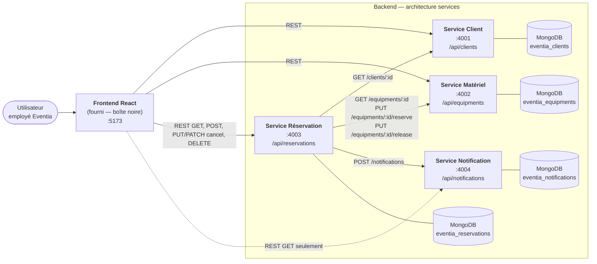
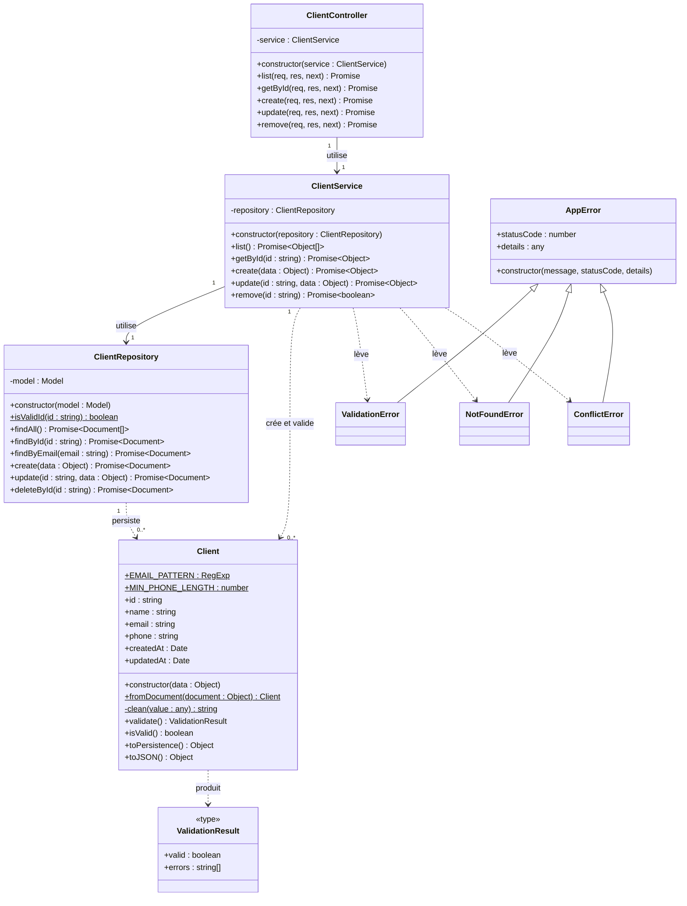
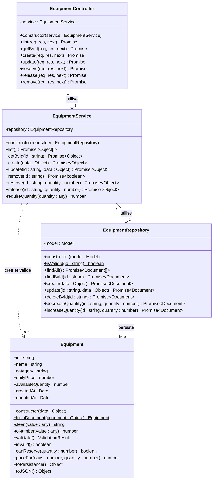
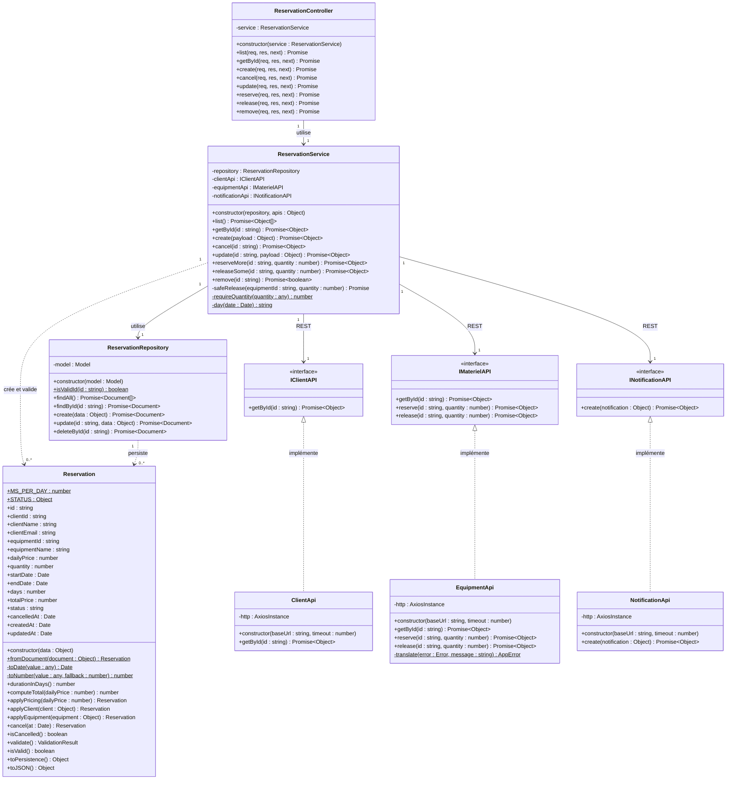
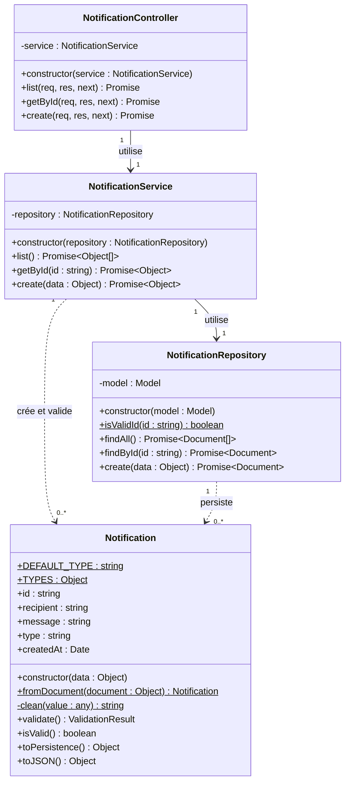
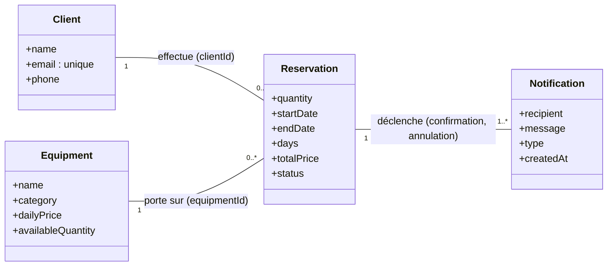
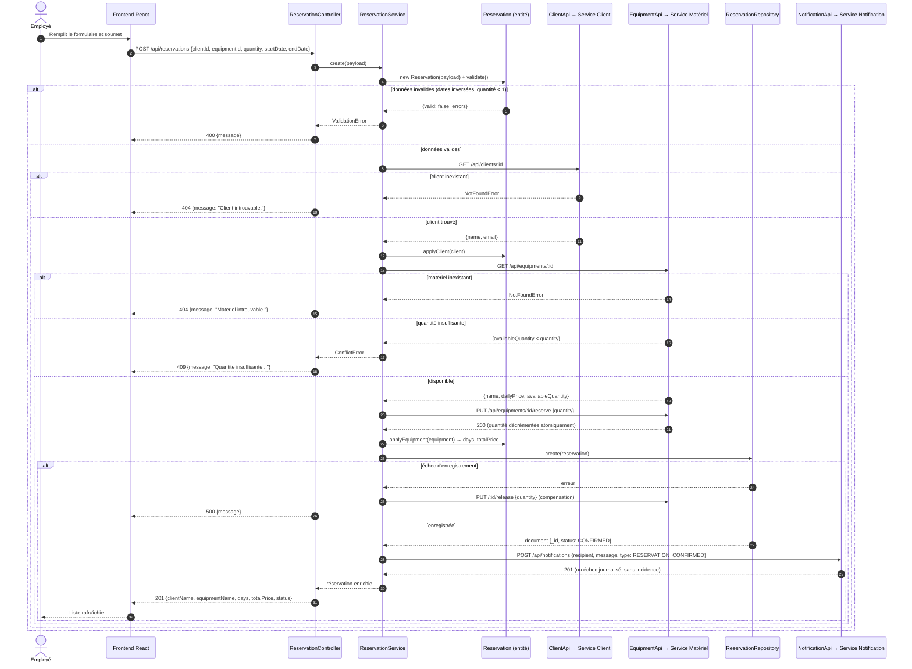
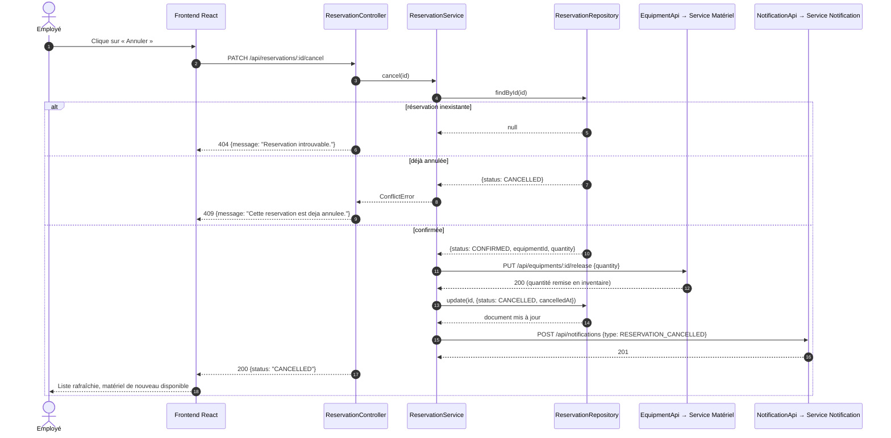
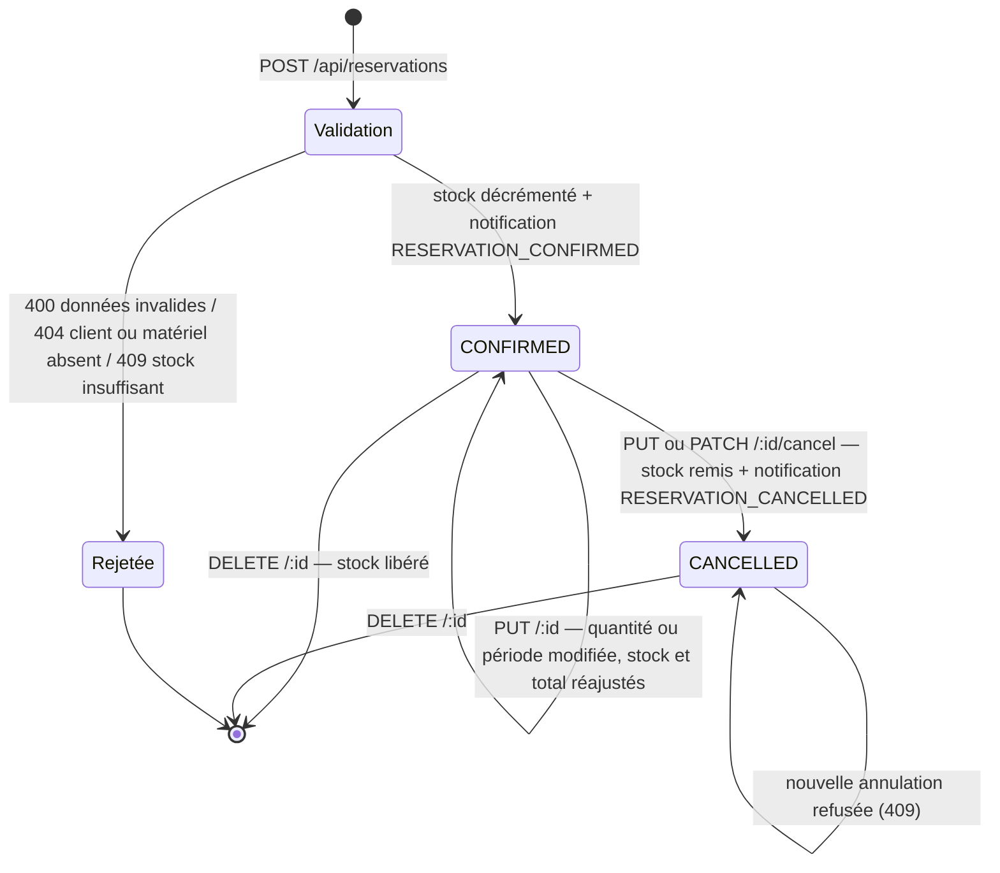

# Livrable 3 — Diagrammes UML

**Projet :** Eventia Location
**Version :** 1.0
Les diagrammes sont écrits en **Mermaid** (rendu automatique sur GitHub). Les sources **PlantUML** équivalentes se trouvent dans `docs/uml/*.puml`.

> Les diagrammes ci-dessous décrivent **exactement** les classes implémentées dans `services/*/src`. Convention UML : `+` public, `-` privé, `_souligné_` = statique (noté `$` en Mermaid).

---

## 1. Diagramme de composants (vue architecturale)

**Règles d'architecture illustrées**

- Chaque service possède **sa propre base MongoDB** ; aucun accès croisé aux données.
- Les services communiquent **exclusivement par REST**.
- Le **service réservation** est le seul coordinateur : il appelle les trois autres.
- Le frontend n'appelle **jamais** le service notification en écriture (lecture seule pour l'affichage de l'historique).

---

## 2. Service Client — diagramme de classes

**Règles métier portées par la classe `Client` :** nom, courriel et téléphone obligatoires ; courriel au format `local@domaine.tld`, normalisé en minuscules ; téléphone d'au moins 7 chiffres. L'unicité du courriel (EF-06) est une règle **applicative** : elle appartient à `ClientService` car elle nécessite une consultation du dépôt.

---

## 3. Service Matériel — diagramme de classes

**Point de conception clé.** `decreaseQuantity` exécute un `findOneAndUpdate` dont le **filtre contient la condition de disponibilité** (`availableQuantity >= quantity`). Le test et la mise à jour forment donc une seule opération atomique MongoDB : deux réservations simultanées ne peuvent pas faire passer le stock sous zéro (EF-16, US-06/CA-5).

---

## 4. Service Réservation — diagramme de classes

**Point de conception clé.** `Reservation` conserve une **copie** de `clientName`, `clientEmail`, `equipmentName` et `dailyPrice` au moment de la réservation. Chaque service ayant sa propre base, aucune jointure n'est possible ; cette copie garantit aussi que le total facturé reste celui du jour de la réservation, même si le prix du matériel change plus tard.

---

## 5. Service Notification — diagramme de classes

`Notification.TYPES` : `INFO` (défaut), `RESERVATION_CONFIRMED`, `RESERVATION_CANCELLED`.

---

## 6. Modèle du domaine et multiplicités

Vue logique des entités métier, indépendamment du découpage en services.

> Les associations sont réalisées par **référence d'identifiant** (`clientId`, `equipmentId`) et non par clé étrangère : les entités vivent dans des bases distinctes.

---

## 7. Diagramme de séquence — création d'une réservation (cas nominal)

---

## 8. Diagramme de séquence — annulation d'une réservation

---

## 9. Diagramme d'états — cycle de vie d'une réservation

---

## 10. Correspondance diagrammes ↔ code source

| Élément du diagramme | Fichier |
| --- | --- |
| `Client`, `ClientRepository`, `ClientService` | `services/client-service/src/domain/` |
| `ClientController` | `services/client-service/src/controllers/ClientController.js` |
| `Equipment`, `EquipmentRepository`, `EquipmentService` | `services/equipment-service/src/domain/` |
| `EquipmentController` | `services/equipment-service/src/controllers/EquipmentController.js` |
| `Reservation`, `ReservationRepository`, `ReservationService` | `services/reservation-service/src/domain/` |
| `ReservationController` | `services/reservation-service/src/controllers/ReservationController.js` |
| `IClientAPI` → `ClientApi` | `services/reservation-service/src/clients/ClientApi.js` |
| `IMaterielAPI` → `EquipmentApi` | `services/reservation-service/src/clients/EquipmentApi.js` |
| `INotificationAPI` → `NotificationApi` | `services/reservation-service/src/clients/NotificationApi.js` |
| `Notification`, `NotificationRepository`, `NotificationService` | `services/notification-service/src/domain/` |
| `NotificationController` | `services/notification-service/src/controllers/NotificationController.js` |
| `AppError`, `ValidationError`, `NotFoundError`, `ConflictError` | `services/*/src/errors/AppError.js` |
| Schémas Mongoose (persistance) | `services/*/src/models/*Model.js` |
