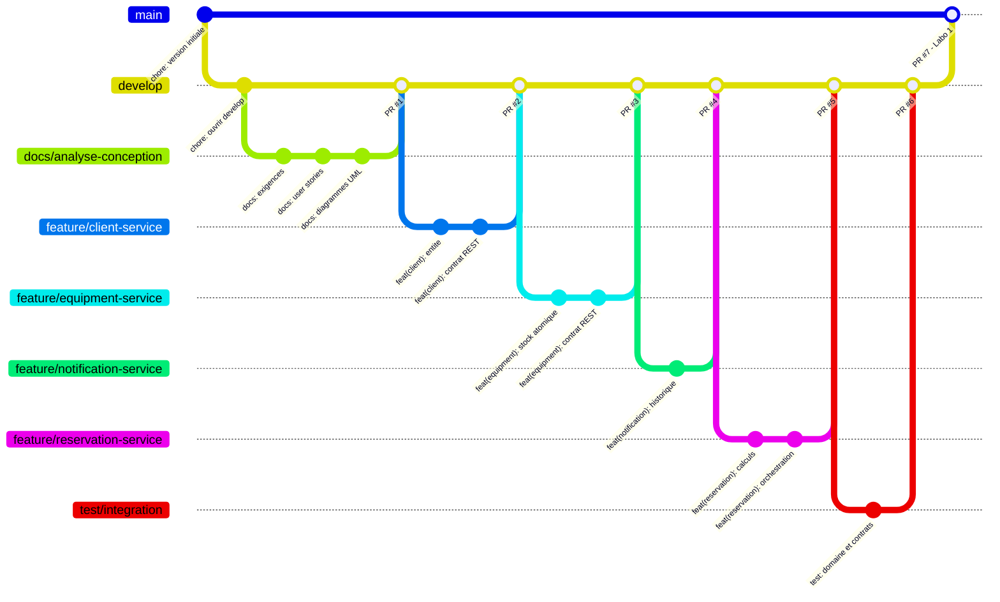

# Livrable 4 — Stratégie Git et GitHub

**Projet :** Eventia Location
**Composition de l'équipe :** un seul développeur, responsable des quatre services.
**Modèle :** GitHub Flow enrichi — branche d'intégration `develop`, une branche de fonctionnalité par service, aucun push direct vers `main`.

> **Note sur le travail en solo.** La stratégie de branches et le passage obligatoire par pull request sont conservés intégralement : ils constituent la discipline demandée par l'énoncé et restent utiles seul (isolation du travail, relecture avant fusion, historique lisible, possibilité de revenir en arrière service par service). Seule la revue *par un autre membre* est remplacée par une **auto-revue documentée** dans le fil de la PR.

---

## 1. Branches du projet

| Branche | Rôle | Statut |
| --- | --- | --- |
| `main` | Version stable et démontrable. **Branche protégée** : aucun push direct. | Fusion finale uniquement |
| `develop` | Branche d'intégration. Toutes les fonctionnalités y arrivent par PR. | Cible de toutes les PR |
| `feature/client-service` | Service client : entité, dépôt, service applicatif, contrat REST. | 6 commits |
| `feature/equipment-service` | Service matériel : catalogue, stock, `reserve` / `release`. | 5 commits |
| `feature/notification-service` | Service notification : entité, historique, contrat REST. | 4 commits |
| `feature/reservation-service` | Service réservation : entité, calculs, orchestration des trois autres. | 6 commits |
| `docs/analyse-conception` | Exigences, user stories, diagrammes UML, stratégie Git, questionnaire, README. | 6 commits |
| `test/integration` | Tests unitaires du domaine et tests des contrats REST. | 2 commits |

L'ordre de fusion respecte les dépendances : `docs` d'abord (l'analyse précède le code), puis `client`, `equipment` et `notification` (services autonomes), puis `reservation` (qui appelle les trois autres), enfin `test/integration`.

## 2. Règles de collaboration appliquées

1. **Aucun push direct vers `main`** : `main` ne reçoit que la PR finale depuis `develop`.
2. Chaque branche de fonctionnalité part de `develop` et y revient par **pull request**.
3. Chaque PR fait l'objet d'une **auto-revue documentée** : avant de fusionner, l'onglet *Files changed* est parcouru et un commentaire de revue est déposé sur la PR à l'aide de la grille du §7. En équipe, cette revue serait faite par un coéquipier.
4. L'**intégration finale** se fait par une PR `develop → main`.
5. Les commits sont **fréquents et significatifs** : un commit = une intention (29 commits de contenu, 38 en comptant le commit initial et les 7 fusions).

## 3. Convention de messages de commit

Format *Conventional Commits* :

```
<type>(<portée>): <description à l'impératif>
```

| Type | Usage |
| --- | --- |
| `feat` | nouvelle fonctionnalité |
| `fix` | correction de bogue |
| `docs` | documentation, diagrammes |
| `test` | ajout ou modification de tests |
| `refactor` | restructuration sans changement de comportement |
| `chore` | configuration, outillage |

Exemples réels du dépôt :

```
feat(client): implementer l entite Client et ses regles de validation
feat(equipment): decrementer le stock de facon atomique
feat(reservation): orchestrer client, materiel et notification
docs(analyse): rediger les exigences fonctionnelles
test: verifier le domaine et les contrats REST des quatre services
```

---

## 4. Marche à suivre — publier le dépôt et ouvrir les PR

Le dépôt local est **déjà initialisé** : les 8 branches existent et les branches de travail ne sont **pas** encore fusionnées, précisément pour que les pull requests soient visibles sur GitHub.

### Étape 1 — Créer le dépôt sur GitHub

Sur github.com : **New repository** → nom `eventia-location` → **Public** → **ne cocher aucune** option d'initialisation (pas de README, pas de `.gitignore`, pas de licence) → *Create repository*.

### Étape 2 — Pousser les branches

```bash
cd "chemin/vers/LABO1"

git remote add origin https://github.com/<votre-compte>/eventia-location.git

# main d'abord : il ne contient que la version fournie avec l'enonce
git push -u origin main

# puis la branche d integration et les branches de travail, non fusionnees
git push -u origin develop
git push -u origin docs/analyse-conception
git push -u origin feature/client-service
git push -u origin feature/equipment-service
git push -u origin feature/notification-service
git push -u origin feature/reservation-service
git push -u origin test/integration
```

### Étape 3 — Protéger `main`

*Settings → Branches → Add branch protection rule* :

- Branch name pattern : `main`
- [x] Require a pull request before merging
- [x] Do not allow bypassing the above settings

> En solo, ne pas cocher *Require approvals* : GitHub interdit d'approuver sa propre PR, la fusion deviendrait impossible.

### Étape 4 — Ouvrir et fusionner les 7 pull requests, **dans cet ordre**

Pour chacune : *Pull requests → New pull request*, choisir la base et la branche, ouvrir, **déposer un commentaire de revue** (grille du §7), puis *Merge pull request* en gardant **Create a merge commit** (ne pas utiliser *Squash*, afin de conserver le détail des commits).

| PR | Base ← Branche | Titre suggéré |
| --- | --- | --- |
| #1 | `develop` ← `docs/analyse-conception` | Analyse et conception : exigences, user stories, diagrammes UML |
| #2 | `develop` ← `feature/client-service` | Service client : CRUD et unicité du courriel |
| #3 | `develop` ← `feature/equipment-service` | Service matériel : catalogue et gestion atomique du stock |
| #4 | `develop` ← `feature/notification-service` | Service notification : historique et création |
| #5 | `develop` ← `feature/reservation-service` | Service réservation : orchestration, calcul du total, annulation |
| #6 | `develop` ← `test/integration` | Tests du domaine et des contrats REST |
| #7 | `main` ← `develop` | Laboratoire 1 — Eventia Location, version démontrable |

### Étape 5 — Se resynchroniser localement

```bash
git checkout main
git pull                      # main contient maintenant tout le projet
git checkout -b local/integration   # optionnel : branche de travail locale
```

> **Sécurité.** Une branche locale `local/integration` contient déjà l'ensemble du projet fusionné et **n'est pas destinée à être poussée**. Elle garantit que le dossier de travail reste complet pendant toute la manœuvre, même si une PR est fusionnée de travers.

---

## 5. Cycle de travail pour une modification ultérieure

```bash
git checkout develop && git pull
git checkout -b fix/prix-arrondi develop
# ... correction ...
git add services/reservation-service
git commit -m "fix(reservation): arrondir le total au cent pres"
git push -u origin fix/prix-arrondi
# Ouvrir la PR fix/prix-arrondi -> develop, se relire, fusionner
```

## 6. Historique attendu après les fusions



## 7. Grille de revue utilisée sur chaque pull request

Commentaire à déposer sur la PR avant la fusion :

- [ ] la PR correspond à **une** user story ou à un défaut identifié ;
- [ ] le **contrat REST** de l'énoncé est respecté (verbes, URL, corps, codes de statut) ;
- [ ] les **règles métier** sont dans le domaine ou le service applicatif, jamais dans le contrôleur ;
- [ ] aucune classe de `domain/` n'importe Express, Mongoose ou Axios ;
- [ ] les erreurs sont retournées au format `{ message }` avec le bon code HTTP ;
- [ ] **aucun fichier de `frontend/` n'est modifié** ;
- [ ] les tests (`tests/domain.test.mjs`, `tests/contracts.e2e.mjs`) passent ;
- [ ] aucun fichier `.env`, `node_modules/` ou secret n'est versionné.

## 8. Lien du dépôt

> À compléter : `https://github.com/<votre-compte>/eventia-location`
> Onglet **Pull requests → Closed** : les 7 PR fusionnées.
> Onglet **Insights → Network** : le graphe des branches.
